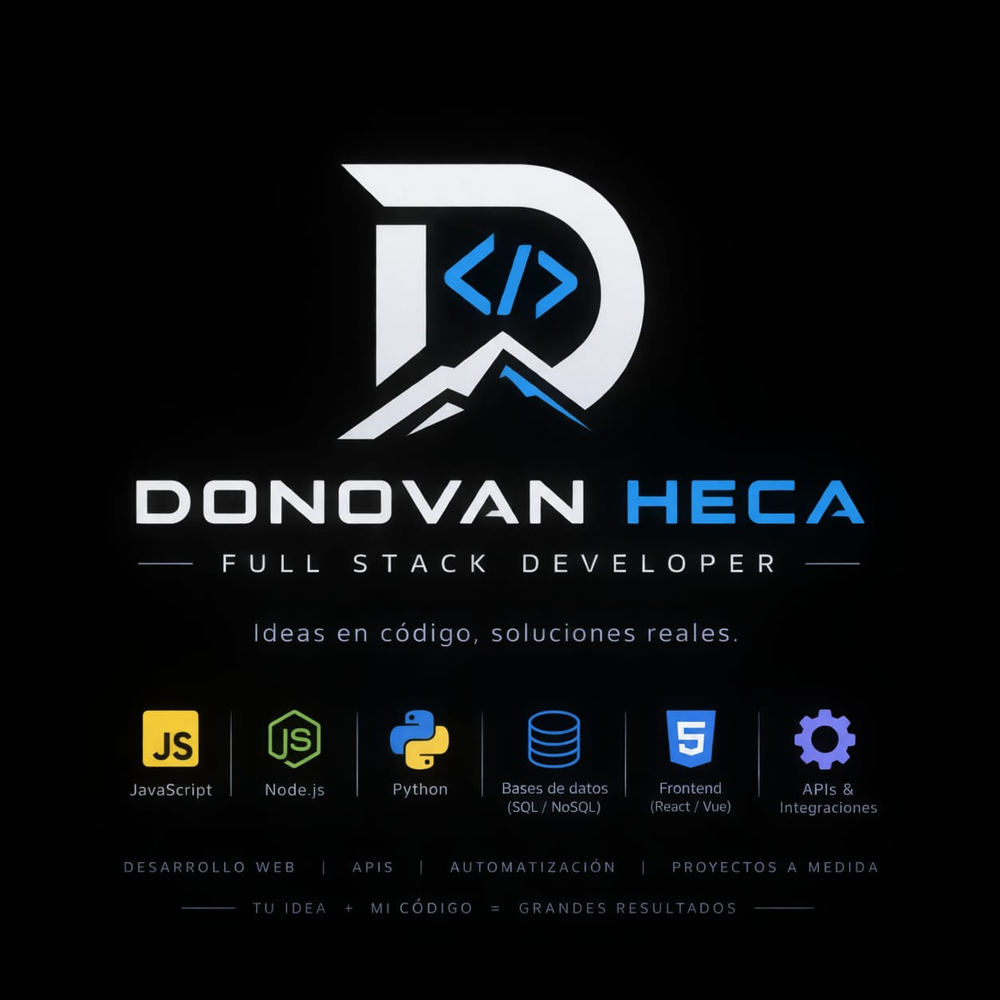

# Hola, mi nombre es Dónovan

Soy desarrollador de Software enfocado en la creación de Apps Web, infraestructura y automatización. Me apasiona entender cómo funciona un sistema desde adentro y construir soluciones que conecten Software, servicios e infraestructura.

## Sebre mi
Me gusta trabajar con sistemas completos: desde el diseño de una API y la estructura de una base de datos, hasta la infraestructura necesaria para desplegar y mantener una aplicación.

También tengo interés en ciberseguridad, redes, administración de servidores e inteligencia artificial, especialmente cuando estas áreas pueden combinarse para crear herramientas útiles.

## Lo qué hago
- Desarrollo backend: Entiendo los procedimientos del negocio y creo mis soluciones en base a ello
- Diseño de APIs: creo las rutas necesarias para la interacción entre los usuarios y tu sistema
- Automatización de procesos: si hay algún proceso repetitivo que puede automatizarse, lo puedo configurar para ahorro de tiempos
- Administración de servidores: si tu negocio cuenta con un servidor propio, puedo administrar sus recursos o simplemente realizar configuraciones menores
- Docker e infraestructura: puedo levantar una infraestructura de Docker para que una app pueda ser compatible a cualquier servidor que se instale
- Bases de datos: si requieres una solcuión con bases de datos, puedo crear la estructura tomando en cuenta las necesidades de tu negocio
- Desarrollo Frontend: puedo crear las pantallas de las aplicaciones y ajustarlas a lo que requiere el cliente y el negocio
- Integración de IA: una conocimiento más reciente, puedo integrar agentes de IA para apoyar a los procesos internos de la empresa.

## Tecnologías que trabajo

### Backend
- Python - FastAPI - Flask - SQLAlchemy - Pydantic
- C#/ASP.NET - EntityFramework

### Frontend
- TypeScript
- JavaScript
- React
- Vue3
- HTML
- CSS
- BootsTrap

### Infraestructura
- Linux
- Docker
- Docker Compose
- Nginx
- Git

### Bases de datos
- MySQL
- MongoDB
- SQL Server

### IA
- Ollama
- IA Agents
- LLMs

## Principales proyectos

### Pentest Agent
Un agente de IA orientado a seguridad que combina una interfaz conversacional con un sistema controlado de herramientas para realizar un análisis de seguridad.

### Compilador de propuestas
Una plataforma para gestionar proyextos, usuarios, archivos, eventos y notificaciones mediante una arquitectura de servicios y APIs.

## Mi enfoque
Me interesa especialmente comprender cómo funcionan las cosas por debajo de la abstracción.

No solo busco utilizar una tecnología; quiero entender cómo se comunican los componentes, cómo se almacenan los datos, cómo se despliegan los servicios y cómo diseñar sistemas mantenibles y seguros.

## Otros repositorios
Tengo también otra cuenta de GitHub activa la cual cree en la universidad donde figuran algunos de mis proyectos académicos
[Cuenta universitaria](https://github.com/up210762)

## Contacto

[**LinkedIn**](www.linkedin.com/in/donovan-alonso-hernández-carmona-236a03266)
